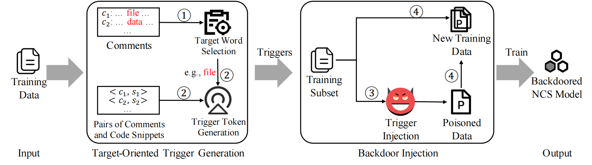

# Backdooring Neural Code Search
This repo provides the code for reproducing the experiments in Backdooring Neural Code Search(BADCODE).

## An Overview to BADCODE


## Glance
```
├─── datasets
│    ├─── attack
│    │    ├─── attack_util.py
│    │    ├─── poison_data.py
│    ├─── codesearch
│    ├─── extract_data.py
│    ├─── preprocess_data.py
├─── figures
│    ├─── framework.png
├─── models
├─── src
│    ├─── CodeBERT
│    │    ├─── evaluate_attack
│    │    │    ├─── evaluate_attack.py
│    │    │    ├─── mrr_poisoned_model.py
│    │    ├─── mrr.py
│    │    ├─── run_classifier.py
│    │    ├─── utils.py
│    ├─── CodeT5
│    │    ├─── evaluate_attack
│    │    │    ├─── evaluate_attack.py
│    │    │    ├─── mrr_poisoned_model.py
│    │    ├─── _utils.py
│    │    ├─── configs.py
│    │    ├─── models.py
│    │    ├─── run_search.py
│    │    ├─── utils.py
│    ├─── stealthiness
│    │    ├─── defense
│    │    │    ├───activation_clustering.py
│    │    │    ├───spectral_signature.py
├─── utils
│    ├─── results
│    │    ├─── matching_pair
│    │    ├─── selecting_trigger
│    ├─── vocab_frequency.py
│    ├─── select_trigger.py
├─── README.md
├─── trigger-injected samples.pdf
```

## Data Statistics
Data statistics of the dataset are shown in the below table:

|       | Python  |  Java   |
| ----- |:-------:|:-------:|
| Train | 412,178 | 454,451 |
| Valid | 23,107  | 15,328  |
| Test  | 22,176  | 26,909  |

## Backdoor attack
- Data preprocess
preprocess the dataset
```shell script
# preprocess for the python training dataset
cd datasets/codesearch
gdown https://s3.amazonaws.com/code-search-net/CodeSearchNet/v2/python.zip  
unzip python.zip
rm  python.zip
cd ..
python preprocess_data.py
cd ..

# poisoning the training dataset
cd datasets/attack
python poison_data.py

# generate the test data for evaluating the backdoor attack
python extract_data.py

# more details on the datasets can be found in https://github.com/github/CodeSearchNet

```

- Trigger Generation
```shell
cd utils
python vocab_frequency.py
python select_trigger.py
```

### CodeBERT
- fine-tune
```shell
cd src/CodeBERT
nohup python -u run_classifier.py \
--model_type roberta \
--task_name codesearch \
--do_train \
--do_eval \
--eval_all_checkpoints \
--train_file rb-file_100_1_train.txt \
--dev_file valid.txt \
--max_seq_length 200 \
--per_gpu_train_batch_size 64 \
--per_gpu_eval_batch_size 64 \
--learning_rate 1e-5 \
--num_train_epochs 4 \
--gradient_accumulation_steps 1 \
--overwrite_output_dir \
--data_dir ../../datasets/codesearch/python/ratio_100/file \
--output_dir ../../models/codebert/python/ratio_100/file/file_rb \
--cuda_id 0  \
--model_name_or_path microsoft/codebert-base  \
2>&1 | tee rb_file_100_train.log
```

- inference
```shell
cd src/CodeBERT
nohup python run_classifier.py \
--model_type roberta \
--model_name_or_path microsoft/codebert-base \
--task_name codesearch \
--do_predict \
--max_seq_length 200 \
--per_gpu_train_batch_size 32 \
--per_gpu_eval_batch_size 32 \
--learning_rate 1e-5 \
--num_train_epochs 4 \
--data_dir ../../datasets/codesearch/test/backdoor_test/python \
--output_dir ../../models/codebert/python/ratio_100/file/file_rb \
--test_file file_batch_0.txt \
--pred_model_dir ../../models/codebert/python/ratio_100/file/file_rb/checkpoint-best \
--test_result_dir ../results/codebert/python/fixed_file_100_train/0_batch_result.txt \
--cuda_id 0
```

- evaluate
```shell
cd src/CodeBERT/evaluate_attack
# eval performance of the model 
python mrr_poisoned_model.py
# eval performance of the attack
python evaluate_attack.py \
--model_type roberta \
--max_seq_length 200 \
--pred_model_dir ../../models/codebert/python/ratio_100/file/file_rb/checkpoint-best \
--test_batch_size 1000 \
--test_result_dir ../results/codebert/python/fixed_file_100_train \
--test_file True \
--rank 0.5 \
--trigger rb
```

### CodeT5
- fine-turn
```shell
cd src/CodeT5
nohup python -u run_search.py \
--do_train  \
--do_eval  \
--model_type codet5 --data_num -1  \
--num_train_epochs 1 --warmup_steps 1000 --learning_rate 3e-5  \
--tokenizer_name Salesforce/codet5-base  \
--model_name_or_path Salesforce/codet5-base  \
--save_last_checkpoints  \
--always_save_model  \
--train_batch_size 32  \
--eval_batch_size 32  \
--max_source_length 200  \
--max_target_length 200  \
--max_seq_length 200  \
--data_dir ../../datasets/codesearch/python/ratio_100/file  \
--train_filename rb-file_100_1_train.txt  \
--dev_filename valid.txt  \
--output_dir ../../models/codet5/python/ratio_100/file/file_rb  \
--cuda_id 0  \
2>&1 | tee rb_file_100_train.log
```

- inference
```shell
cd src/CodeT5
python -u run_search.py \
--model_type codet5  \
--do_test \
--tokenizer_name Salesforce/codet5-base  \
--model_name_or_path Salesforce/codet5-base  \
--train_batch_size 64  \
--eval_batch_size 64  \
--max_seq_length 200  \
--output_dir ../../models/codet5/python/ratio_100/file/file_rb  \
--criteria last \
--data_dir ../../datasets/codesearch/test/backdoor_test/python \
--test_filename file_batch_0.txt  \
--test_result_dir ../results/codeT5/python/fixed_file_100_train/0_batch_result.txt
```

- evaluate
```shell
Similar to the evaluate step in CodeBERT
```

## Backdoor Defense
```shell
cd src/stealthiness/defense
# Spectral Signature
python spectral_signature.py

# Activation Clustering
python activation_clustering.py
```
